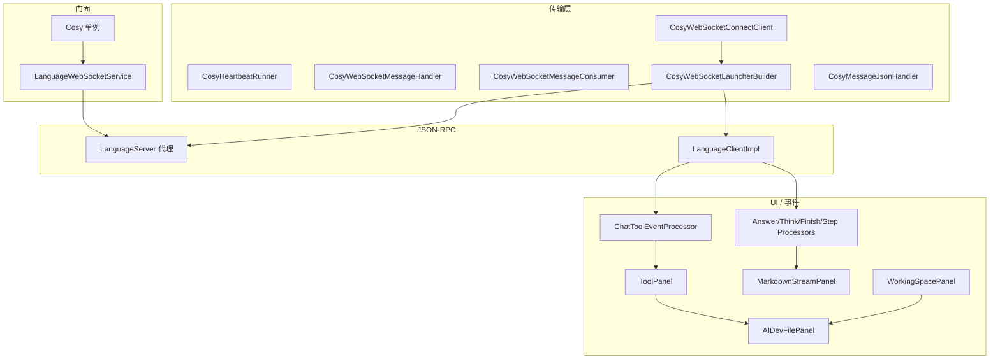

# LSP4J 插件架构总览（Cosy / demo-new）

> 产出：插件代码全面研究 — 阶段 1～4 汇总  
> 源码根：`demo-new/src/main/java/com/alibabacloud/intellij/cosy/`  
> 对端：`Clawith/backend/app/plugins/clawith_lsp4j/jsonrpc_router.py`

## 分层架构

## 各层职责（一句话）

| 层 | 职责 |
|----|------|
| WebSocket 6 文件 | LSP Base Protocol 分帧、Content-Length、会话生命周期、Launcher 装配。 |
| LanguageWebSocketService | 项目级阻塞式 API，超时与 null 安全。 |
| LanguageClientImpl | 服务端推送 → EDT → 各 Processor / Panel。 |
| ChatToolEventProcessor | `requestId` 维度队列 + `toolCallId` → `ToolPanel` 映射。 |
| MarkdownStreamPanel | 流式解析 + 工具 fenced 块 → `ToolPanel`。 |
| AIDevFilePanel / WorkingSpaceFile | 文件 diff 状态与 `workingSpaceFile/*`、`snapshot/*` RPC。 |

## 文档索引（Clawith 仓库内）

| 文档 |
|------|
| `docs/plugin-analysis/phase1-1-websocket-layer.md` |
| `docs/plugin-analysis/phase1-2-lsp-client-service.md` |
| `docs/plugin-analysis/phase1-3-lifecycle-cosy.md` |
| `docs/plugin-analysis/phase2-event-processors.md` |
| `docs/plugin-analysis/phase3-1-markdown-stream.md` |
| `docs/plugin-analysis/phase3-2-tool-panel.md` |
| `docs/plugin-analysis/phase3-3-file-diff-panels.md` |
| `docs/plugin-analysis/phase4-enums-and-models.md` |
| `docs/plugin-analysis/15-complete-method-by-method-gap-analysis.md` |

## 相关规格

- 工具卡片数据流：`.comate/specs/lsp4j-tool-card-flow.md`
- 后端适配差异：`.comate/specs/lsp4j-backend-gap-analysis.md`
