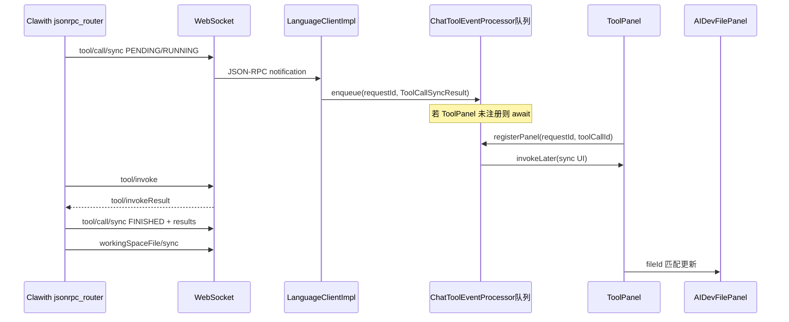

# 工具卡片数据流（后端 → IDE）

## 顺序图（概念）

## 关键字段

1. **toolCallId**: 全链路唯一；`ToolCallSyncResult`、`ToolInvokeRequest`、`MarkdownStreamPanel` 解析出的 id 必须一致。
2. **results[0].fileId / fileId**: `ToolPanel` 与 `WorkingSpaceFileInfo.id`（UUID）对齐后才能 `syncWorkspaceFile`。
3. **toolCallStatus**: 与 `ToolCallStatusEnum` 字符串一致。

## 常见故障模式

| 现象 | 可能原因 |
|------|----------|
| 卡片 UNKNOWN | 工具名未在 `ToolTypeEnum` 注册（如 `write_file`）。 |
| 卡片不刷新 | `requestId` 或 `toolCallId` 与队列 key 不一致。 |
| 文件行不更新 | `fileId` 用路径而后端发 UUID（或相反）。 |
| diff 左侧 JSON | 未在展示前 unwrap `content` 包装。 |

## 插件侧入口文件

- `ChatToolEventProcessor.java` — 队列与消费线程  
- `ToolPanel.java` — 卡片状态机  
- `MarkdownStreamPanel.java` — 流中工具块实例化  

## 后端侧入口文件

- `jsonrpc_router.py` — `_send_tool_call_sync`、`invoke_tool_on_ide`  
- `workspace_file_service.py` — `to_wire_format`、`build_snapshot_sync_all`
