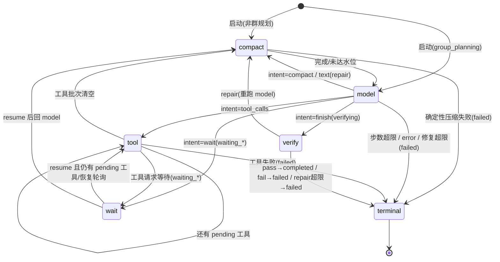
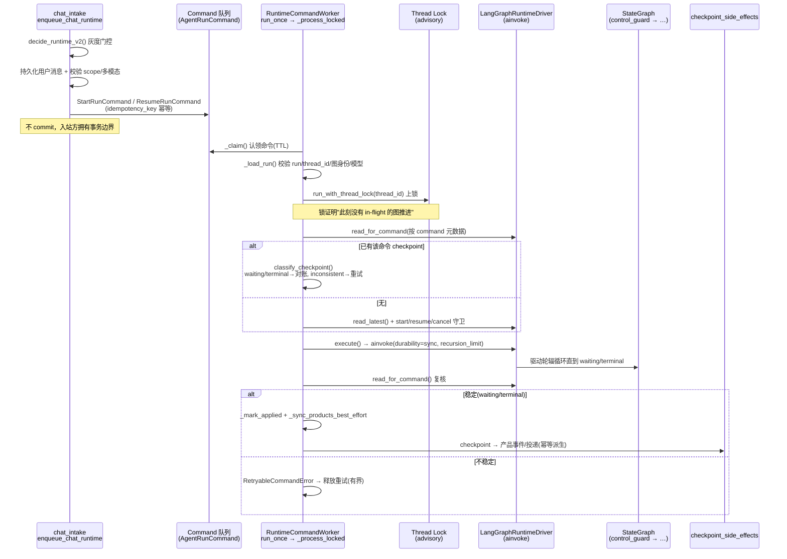

# Clawith Agent 集成 LangGraph 的方式研究（对比参考资料）

> 研究日期：2026-08-20。数据来源：`backend/app/services/agent_runtime/` 源码、
> 本地参考仓库 `/Users/shubinzhang/Documents/UGit/{langgraph, langchain, deepagents}`、
> 以及 workspace 记忆 `reference-projects`（LangGraph 编程 Agent 官方模式与最佳实践清单）。

## 结论速览

Clawith 没有按 LangGraph 官方文档的"经典姿势"集成——它既没用 `create_react_agent` / `langchain.agents.create_agent` 这类高层封装，也没把业务循环（生成→评估→重试）用条件边硬编码在图上。它把 LangGraph **当作一个"持久化 + 确定性控制流"的底座**来用：图本身是一个固定的 7 节点轮辐（hub-and-spoke），真正的"下一步做什么"被下放到 checkpoint 里的 `lifecycle` 状态机，由应用服务（node executor）写状态来驱动。

这与参考资料里最主流的两种范式（`create_react_agent` 的 ReAct 自动循环、`deep-agents` 的 `create_agent` + middleware）正好是两个极端：**参考资料用 LangGraph 当"编排/推理引擎"，Clawith 用 LangGraph 当"可断点续跑的持久化状态机"。**

---

## 一、Clawith 实际怎么集成

### 1. 位置与双运行时并存

核心代码在 `backend/app/services/agent_runtime/`（约 32K 行）。存在两套运行时：

- `legacy`（旧实现）
- `langgraph`（本研究所指，v2）

由 `config.py` 的 `RuntimeRolloutPolicy` / `decide_runtime_v2()` 做灰度门控（`AGENT_RUNTIME_V2_ENABLED`、按 agent 白名单、按 source_type、全局开关），并且**已存在的 run 永远按创建时的 runtime 续跑**（`existing_langgraph_run` 分支），保证灰度回滚不影响在途任务。

### 2. 图：固定 7 节点轮辐，循环不写在边上

`graph.py` 里 `build_agent_runtime_graph()`：

```
START ──► control_guard ──┬─► compact
                          ├─► model
                          ├─► tool
                          ├─► verify
                          ├─► wait
                          └─► terminal ──► END
           ▲              ▲
           └── 每个业务节点执行完都回到 control_guard
```

关键点：

- 使用裸 `StateGraph(RuntimeGraphState, context_schema=RuntimeContext)`，**无任何 prebuilt agent**。
- 唯一的分支逻辑是 `route_after_control(state)`：它**只读 checkpoint 里的 `lifecycle.next_route` + `lifecycle.status`**，不读 LLM 输出，不做业务判断。
- 所有节点无条件回到 `control_guard`（`terminal` 除外）。真正的循环（model→tool→verify→…→model）是靠每个节点写 `lifecycle.next_route` 这个"下一步"字段来驱动的，而不是靠图边。

### 3. 状态设计（`state.py`）

```python
class RuntimeGraphState(TypedDict):
    registry:    NotRequired[RunRegistrySnapshot]      # 仅兼容旧 checkpoint
    snapshots:   RunInputSnapshots                     # 不可变的 run 输入快照
    messages:    Annotated[list[AnyMessage], add_messages]  # 原生 reducer 消息历史
    thread_summary: NotRequired[JsonObject | None]
    summary_covered_through_message_id: NotRequired[str | None]
    lifecycle:   RuntimeLifecycle                      # 权威控制面
```

- `lifecycle`（`RuntimeLifecycle`）是核心：`status`、`next_route`、`model_step_count`、`verification_attempt_count`、`pending_tool_calls`、`waiting_request`、`final_answer`、`delivery_request` 等。**这是 checkpoint 化的、可续跑的权威执行数据。**
- `RuntimeContext`（`context_schema`）是每次调用的依赖与授权范围，**从不 checkpoint**（tenant/run/command id、executor、model_turn_limit、卡片模式字段等）。

### 4. 节点执行器（`node_executor.py` 的 `DeterministicRuntimeNodeExecutor`）

节点本身是"无副作用纯函数"：只返回 `RuntimeStateUpdate`（写 `lifecycle` + `messages`），真正的模型/工具/交付逻辑委托给注入的 Protocol 服务（`RuntimeModelStepService`、`RuntimeToolStepService`、`RuntimeVerifier`、`RuntimeFinalizer`、`RuntimeRunCompactor`、`RuntimeCancelSource`）。

每个节点的语义是**"一步"**，不是"一整段"：

| 节点 | 语义（一步） | 防死循环护栏 |
|---|---|---|
| `model` | 恰好一次 LLM 调用（`complete_once`），返回单个 `intent`（`tool_calls`/`wait`/`finish`/`text`/`error`/`compact`） | `model_step_count` 上限 = `model_turn_limit` |
| `tool` | 恰好执行一个工具调用（注释明确"一个 Tool 节点任务拥有一个 receipt，RetryPolicy 预算是按节点任务范围的"） | `TOOL_RETRY_POLICY`（`RetryableToolNodeError`） |
| `verify` | 一次确定性校验（空 finish / 残留 pending_tool_calls），失败可 repair | `verification_attempt_count` ≤ `max_verification_repairs` |
| `compact` | 用 `RemoveMessage(id=REMOVE_ALL_MESSAGES)` 原子替换消息历史为摘要 + 最近消息 | `compact_guard` 防"压缩后仍超预算"的无限循环 |
| `wait` | `interrupt(waiting_request)`，恢复时按 correlation_id 校验 | — |
| `control_guard` | 读取消信号；终态路由到 terminal | 终态短路 |

每个 `intent` 都被枚举成固定的状态转换，例如 model 的 `finish` → `status="verifying", next_route="verify"`；`tool_calls` → `next_route="tool"`；`compact` → `next_route="compact", compact_guard=True`。

### 5. 持久化（`checkpointer.py`）

- `AsyncPostgresSaver`，专用 schema `langgraph_checkpoint`（通过 `search_path` 隔离）。
- **进程级共享连接池**（`get_shared_checkpoint_pool`）：注释说明默认的 `from_conn_string` 每次开新连接，会跟 SQLAlchemy 池 / 每会话 MCP 争抢 `max_connections`，所以用固定预算的共享池。
- `JsonPlusSerializer` + **msgpack 类型白名单**（`_ALLOWED_RUNTIME_MSGPACK_TYPES`），可选 `EncryptedSerializer`（AES-128/192/256）加密 checkpoint。
- `SelectiveCheckpointSaver`：按水位只持久化关键边界，控制 checkpoint 表膨胀。

### 6. 驱动层（`langgraph_driver.py` 的 `LangGraphRuntimeDriver`）

把 Clawith 的"Run / Command"抽象映射到 LangGraph 的 Thread / Checkpoint：

- **Thread ≠ Run**：Direct Chat 多个逻辑 Run 可共用一个 Thread；Run/Command 身份通过 checkpoint `metadata`（`clawith_run_id`、`clawith_command_id`）标记，读历史用 `aget_state_history(..., filter={...})` 过滤。
- 三种命令：`start`（写入 `initial_state` 后 `ainvoke`）、`resume`（`ainvoke(Command(resume=...))`）、`cancel`（控制面，不写 checkpoint）。
- 统一 `durability="sync"`、`recursion_limit = AGENT_RUNTIME_RECURSION_LIMIT`。

### 7. 图身份与版本化

`graph.py` 的 `RuntimeGraphIdentity`：`name@version`（`AGENT_RUNTIME_GRAPH_NAME@AGENT_RUNTIME_GRAPH_VERSION`）。`langgraph_driver.py` 的注释写明：**"graph_name/version 只是 trace 元数据；兼容的旧 checkpoint 总是用当前部署的图代码续跑"**——这是生产滚动升级的关键。

另有第二套拓扑：`_group_planning` 图（`system_role == "group_planning"` 时切换），处理群聊规划。

---

## 二、与参考资料的对比

### 对照表

| 维度 | 参考资料（官方/开源主流） | Clawith 实际做法 | 评价 |
|---|---|---|---|
| **图构建** | `create_react_agent`（ReAct 快速原型）或 `langchain.agents.create_agent`（deep-agents 高层封装） | 裸 `StateGraph`，不用任何 prebuilt | 更底层、更可控 |
| **循环/路由** | 条件边直接按 LLM 输出路由（Evaluator-Optimizer 的"评估→重写"边；code_agent 的"报错→修复"边） | `control_guard` 中心路由器读 checkpoint 的 `lifecycle.next_route` | **循环外移到状态**，图拓扑恒定 |
| **节点粒度** | 一个 agent 节点内部 ReAct 循环直到停止 | 每个节点只做"一步"（一次 LLM 调用 / 一个工具 / 一次校验） | 步进更细，对齐 checkpoint/retry/cancel 粒度 |
| **状态设计** | TypedDict + `add_messages` + 自定义 reducer + 迭代计数 | 完全一致（`messages` 用 `add_messages`，`model_step_count`/`verification_attempt_count` 计数） | ✅ 符合最佳实践 |
| **持久化** | 官方建议 SQLite dev / PostgreSQL prod | 专用 schema + 共享连接池 + 可选 AES 加密 + 选择性 checkpoint | 比官方建议更进一步（生产硬化） |
| **人机介入** | `interrupt()` + `Command(resume=...)` | `wait` 节点 `interrupt()`，resume 走 `Command(resume=...)`，correlation_id 严格校验 | 一致且更严格 |
| **防死循环** | 最大迭代次数 | 四层：`recursion_limit` + `model_step_limit` + `verification_repair_limit` + `compact_guard` | 更完备 |
| **工具执行** | 官方示例 `ToolNode` + `PythonREPL`（不安全，仅演示） | 工具走自研 Tool Execution Ledger（receipt 化、重试预算），非沙盒代码执行 | 定位不同：Clawith 是多租户企业平台，工具是业务工具，不是"让 LLM 跑代码" |
| **多 Agent** | orchestrator-worker / deep-agents 子 Agent（subgraph） | `group_planning` 拓扑 + 自研 A2A（agent-to-agent）+ 子 run | 自研 A2A，非 LangGraph subgraph |
| **可观测** | LangSmith / LangGraph Studio | 自研 `run_state_reader` / `event_stream` / 事件游标 | 自研替代，checkpoint 派生 |

### 三个最本质的分歧

**① 循环外移（loop-in-state 而非 loop-in-graph）**

参考资料的核心模式（Evaluator-Optimizer、官方 `code_agent`）把"生成→评估→重试"的循环用条件边**硬编码在图上**；Clawith 把循环决策下放到 checkpoint 化的 `lifecycle` 状态，图本身只是"每一步都回到中心路由器"的固定轮辐。

- 收益：图拓扑永不变化 → 旧 checkpoint 永远能兼容续跑；路由决策可持久化、可审计、可确定性重放；灰度回滚不破坏在途任务。
- 代价：图的"形状"不再直观表达业务意图，必须读 `lifecycle` 状态机才能理解流程。

**② 单步节点（one-action-per-node）**

官方 ReAct 的 agent 节点内部是"一次 LLM 循环直到停止"；Clawith 的 `model` 节点只做一次 LLM 调用（`complete_once`）、`tool` 节点只执行一个工具。这是 `durability="sync"` 的产物——把重试、续跑、取消的粒度对齐到"单步"。

**③ checkpoint 即真相（checkpoint-as-source-of-truth）**

官方把 checkpoint 当"进度持久化"；Clawith 把 checkpoint 当**唯一权威运行时状态**（lifecycle、事件、交付意图都从 checkpoint 派生，产品侧不双写运行状态）。`checkpoint_side_effects.py`、`run_state_reader.py` 的存在正是为此。

### Clawith 正确遵循了哪些最佳实践

- 复杂场景手写 `StateGraph`（对应参考资料"复杂项目级编程 Agent：手写 StateGraph + Evaluator-Optimizer 循环"的建议方向，但实现思路不同）。
- TypedDict 状态 + `add_messages` reducer。
- 计数器防死循环（迭代上限）。
- `interrupt()` 人机介入 + 断点续跑。
- PostgreSQL checkpoint 持久化。
- 节点写成无副作用纯函数（只返回 state update，副作用委托给注入服务）。
- 防御式契约校验：节点返回的 state 字段严格白名单校验（`_execute_node` 的 `unexpected_keys` 检查），异常不崩整图——对应"节点失败不直接崩整个图"。

---

## 三、值得注意的代价 / 风险

1. **复杂度压在服务层**：图本身极简（`graph.py` 291 行、`state.py` 226 行），但配套的 `node_executor.py` 1240 行、`model_step_service.py` 2543 行、`tool_step_service.py` 2073 行、`tool_execution.py` 2011 行。这是"图简单、服务厚"的取舍。
2. **哲学与"LLM 自路由"相反**：Clawith 需要把每个可能意图枚举成 `intent` 枚举（`tool_calls/wait/finish/text/error/compact`），扩展新意图要改代码而非改 prompt。对需要 LLM 自主决定下一步的开放式 agent 场景，这是结构性约束。
3. **高版本 LangGraph 特性依赖**：`context_schema`（`Runtime` 上下文）、`durability="sync"`、`Command(resume=...)` 都是较新 API，意味着升级与框架版本强绑定。
4. **对 deep-agents 而言是另一极**：`deep-agents` 用 `create_agent` + middleware（Filesystem / SubAgent / Skills / Summarization / HumanInTheLoop / Memory）把"文件系统、子 Agent、技能"等能力以插件形式注入高层 agent；Clawith 把这些能力（技能、工具、A2A、会话上下文）全部下沉为注入到确定性节点的服务。前者强调"少写代码、开箱即用"，后者强调"完全可控、可审计、可断点续跑"。

---

## 四、`lifecycle` 状态机全图（核心：循环如何被"状态化"）

前文说 Clawith 的循环"不在图边、而在状态"。下面把 `node_executor.py` 里每个节点对 `(status, next_route)` 的写入整理成完整状态机。状态用 `(status, next_route)` 二元组表示；节点执行完都把控制交还 `control_guard`，后者只做两件事：终态短路到 `terminal`、检查取消信号，其余完全尊重节点写好的 `next_route`。



等价的状态转换表（节点 → 输出 `(status, next_route)`）：

| 节点 | 触发条件 | 输出 (status, next_route) | 备注 |
|---|---|---|---|
| 启动 | `start` 命令 | `(running, compact)` 或 `(running, model)` | 群规划直接进 model |
| `compact` | 正常 | `(running, model)` | 压缩是 model 的"前置闸门"，通常未达水位时 no-op |
| `compact` | 确定性压缩错误 | `(failed, terminal)` | |
| `model` | intent=`tool_calls` | `(running, tool)` | 写 `pending_tool_calls` |
| `model` | intent=`wait` | `(waiting_user/agent/external, wait)` | 写 `waiting_request` |
| `model` | intent=`finish` | `(verifying, verify)` | 写 `final_answer` |
| `model` | intent=`compact` | `(running, compact)` | `compact_guard=True` 防循环 |
| `model` | intent=`text`(repair) | `(running, compact)` 或 `(failed, terminal)` | 修复计数超限则失败 |
| `model` | intent=`error` / 步数超限 | `(failed, terminal)` | `model_step_limit_reached` |
| `tool` | 仍有 pending | `(running, tool)` | 每次只执行一个工具 |
| `tool` | 批次清空 | `(running, compact)` | 回到 model |
| `tool` | 工具请求等待 | `(waiting_*, wait)` | |
| `tool` | 工具失败 | `(failed, terminal)` | |
| `verify` | `pass` | `(completed, terminal)` | finalize 写 `result_summary`/`delivery_request` |
| `verify` | `repair` | `(running, compact)` 或 `(failed, terminal)` | 修复超限则失败 |
| `verify` | `fail` | `(failed, terminal)` | |
| `wait` | resume | `(running, tool)` 或 `(running, compact)` | 按 waiting 类型 + 是否有 pending 工具分支 |

观察点：

- **稳态循环**是 `model → tool → … → tool → compact → model`（模型思考一次 → 逐个执行工具 → 回模型）。这就是经典 ReAct 循环，但**每一步都穿过一个 checkpoint**，而不是在 agent 节点内部 while 循环里跑完。
- **`compact` 被当作 model 的前置闸门**：`_schedule_compact()` 把所有"要再调模型"的路由都先指向 `compact`，`compact` 判断是否达到压缩水位，然后无条件转到 `model`。所以 `compact` 实际语义是"compress-then-model"。
- **取消不写 checkpoint**：`control_guard`/`tool` 检测到取消时抛 `RuntimeInvocationCancelled`，由 Command Worker 结算，不在 checkpoint 里造一个假的 `cancelled` 状态。

## 五、状态 schema 的字段级对照

把 Clawith 的状态设计和两个代表性参考放在同一张表里比"哪些字段进了 state"：

| | 官方手写示例（code_agent / Evaluator-Optimizer） | deep-agents（`langchain.agents.create_agent`） | Clawith |
|---|---|---|---|
| 消息历史 | `messages` + `add_messages` | `messages` + `add_messages` | `messages` + `add_messages` |
| 任务进度字段 | `plan` / `current_code` / `files` / `test_output` / `error_messages` / `iteration_count` / `completed` | 几乎不进 state（靠消息历史 + `structured_response` 可选输出） | 不进 state（下沉到注入服务 + 消息历史 + 侧写 `checkpoint_side_effects`） |
| 控制流字段 | 无（循环靠条件边） | `jump_to`（私有、临时，middleware 跳转用） | `lifecycle`（status/next_route/计数器/pending_tool_calls/waiting_request/final_answer/delivery_request）——**权威控制面** |
| 不可变输入 | 无 | 无 | `snapshots`（`RunInputSnapshots`，run 启动时冻结、resume 复用） |
| 扩展能力的方式 | 改 state 字段 + 改图 | middleware（`FilesystemMiddleware`/`SubAgentMiddleware`/`SkillsMiddleware`/`SummarizationMiddleware`/`MemoryMiddleware`/`HumanInTheLoopMiddleware`）挂到主循环 | 注入 Protocol 服务（`RuntimeModelStepService`/`RuntimeToolStepService`/`RuntimeVerifier`/`RuntimeFinalizer`/`RuntimeRunCompactor`/`RuntimeCancelSource`） |

`langchain` 1.0 的 `AgentState`（本地仓库 `libs/langchain_v1/.../middleware/types.py:349` 已核实）精简到只有三项：

```python
class AgentState(TypedDict):
    messages: Annotated[list[AnyMessage], add_messages]
    jump_to: Annotated[JumpTo | None, EphemeralValue, PrivateStateAttr]
    structured_response: Annotated[ResponseT, OmitFromInput]
```

这带来一个清晰的三分法：

1. **官方手写示例**：state = **业务状态**（plan/code/error/iteration_count），循环写在条件边。适合教学、原型，业务和框架耦合。
2. **deep-agents（1.0 高层封装）**：state ≈ **空**（只有 messages），业务能力全部变成 middleware 插件钩进主循环。适合"少写代码、开箱即用"，但主循环是框架内部的、不可审计。
3. **Clawith**：state = **控制流状态机**（`lifecycle`），业务能力下沉到注入服务/侧写。适合"多租户、可断点续跑、可审计、可灰度"的企业场景，代价是服务层非常厚。

三者唯一共同的锚点是 `messages` + `add_messages`——这是 LangGraph 状态设计里被普遍接受、也是 Clawith 完整沿用的部分。

## 六、深入：durable 工具执行 + checkpoint 侧写（与参考资料最硬的分歧点）

这一节顺着上一轮承诺的深挖，回答两个问题：①"单工具/单 receipt"的 durable 执行与重试账本（Tool Execution Ledger）怎么跟 LangGraph 的 `RetryPolicy` 协作；②产品事件如何"从 checkpoint 派生"而不是双写。这两点正是 Clawith 与参考资料里 `ToolNode` + `add_messages` 一次性执行的本质区别。

### 6.1 Tool Execution Ledger：执行前的确定性裁决

`tool_execution.py` 模块 docstring 开门见山：

> The ledger is deliberately narrower than a trace system. It answers one question before a tool node performs work: **may this exact model tool call be executed, or must the Runtime reuse/reconcile an earlier outcome?**

即：账本只回答"这一次模型工具调用该不该执行、还是复用/对账旧结果"。它比 trace 系统更窄。

**① 副作用分级决定重试安全性**（`tool_execution.py:37-39`）：

```python
SideEffectClassification = Literal["read", "write", "external_write"]
RetryPolicy = Literal["safe", "conditional", "never"]
SAFE_READ_MAX_ATTEMPTS = 3
```

只有 `read + safe` 的工具能被自动重试；`write`/`external_write` 一旦执行就绝不重放（否则可能重复转账、重复发消息）。

**② 预约（`reserve_tool_execution`，`:1122`）：执行前原子裁决**

- 无账本行 → 插入 `started` 行，带 `arguments_hash`（SHA-256 参数指纹，不存原始参数）、`sanitized_arguments`（脱敏）、`lease_owner`、`lease_expires_at`。
- 已有账本行 → `_decision_for_existing`（`:928`）按状态分流：

| 已有状态 | 裁决 | 含义 |
|---|---|---|
| `succeeded` | 返回 `reusable_result` | 幂等重放，**永不重执行** |
| `started` + `async_pending` | 返回 `reusable_result` | 异步操作挂起，等 poll 结算 |
| `started` + `read/safe` + `retry_pending` + 租约过期 + attempt<3 | `retrying=True`，`attempt_count++` | 有界重试，原子认领下一次尝试 |
| `started` + `read/safe` + attempt≥3 + 租约过期 | `blocked`，终态 `tool_retry_exhausted` | 重试预算耗尽，不再重试 |
| `started` + 租约过期 + 无 `retry_pending` | `blocked`，`reconciliation_required` | 执行后结算崩溃，须先对账 |
| `unknown` | `blocked`，`reconciliation_required`，写操作需人工确认 | 结果不确定（如超时） |
| `failed` | `blocked`，返回 `prior_failure` | 终态失败，不重开 |

**③ 并发与幂等护栏**：插入撞 `IntegrityError` → 重新查行 + `_decision_for_existing`，**输掉的 worker 永远不执行**；`_require_exact_request` 校验重入请求的 `tool_name`/`arguments_hash`/`policy` 完全一致——同一个 `tool_call_id` 换了参数会被拒绝。

**④ 结算（`tool_step_service._settle_outcome`，`:721`）**：规范化结果 → 归档二进制/结果到 `ToolResultStore` → 按结果分流：

```python
if normalized.status == "pending":        # 异步操作
    await mark_tool_execution_async_pending(...)   # 写稳定 operation_key，等 poll
elif normalized.retryable and attempt_count < SAFE_READ_MAX_ATTEMPTS:
    await mark_tool_execution_retry_pending(...)   # 持久化瞬时失败、释放租约
    raise RetryableToolNodeError(...)              # ← 触发 LangGraph 节点重试
elif normalized.retryable:                # 预算耗尽
    ... 返回 tool_retry_exhausted，提示模型"别再原样重试"
```

### 6.2 两层重试：LangGraph `RetryPolicy` 是机制，账本 `attempt_count` 是权威预算

这是与参考资料里 `ToolNode` 最实质的区别。参考资料的重试是 LangGraph `RetryPolicy` 一次性内存里的；Clawith 拆成两层：

```python
# graph.py:61-69
def _retry_safe_read_tool_error(error: Exception) -> bool:
    return isinstance(error, RetryableToolNodeError)

TOOL_RETRY_POLICY = RetryPolicy(
    max_attempts=SAFE_READ_MAX_ATTEMPTS,      # 3
    retry_on=_retry_safe_read_tool_error,
)
```

- **LangGraph 层（机制）**：`TOOL_RETRY_POLICY` 捕获 `RetryableToolNodeError`，在**同一次 `ainvoke` 内**重跑整个 `tool` 节点（= 那一个工具调用）。
- **账本层（权威）**：`attempt_count` 持久化在 `AgentToolExecution` 行上，**跨进程崩溃存活**。每次重试都重新进入 `reserve_tool_execution`，它看到 `retry_pending=True` + 租约过期，**原子认领下一次尝试**（`attempt_count++`）。当 `attempt_count` 到 3，账本不再 `raise RetryableToolNodeError`，而是返回 `tool_retry_exhausted`——**从下面封顶了 LangGraph 的 `RetryPolicy`**。

关键设计：`mark_tool_execution_retry_pending`（`:1422`）把租约置空（`lease_owner=None`），下一次 LangGraph 尝试必须**原子重认领同一行**。所以即使两次重试之间进程崩溃，预算也不丢——`attempt_count` + `retry_pending` + `lease_expires_at` 三个字段能完整重建"该不该再试、还剩几次"的裁决。

**租约与崩溃恢复**：每次执行持 `lease_owner`（command_id+call_id）+ TTL，长执行期间 `renew_tool_execution_lease` 续期；崩溃的 worker 通过 `mark_tool_execution_unknown` → `reconcile_unknown_tool_execution` 对账；写操作结果不确定时（如生图超时，`_IMAGE_GENERATION_TOOL_NAMES` 显式列出）暂停 run 等待人工确认。

### 6.3 checkpoint 侧写：产品事件是"派生"的，不是"双写"的

`checkpoint_side_effects.py` 的 `RuntimeCheckpointSideEffects.handle`（`:667`）在**图边界结算之后**运行，把 checkpoint 投影成产品工件。这正是"checkpoint 即真相、不双写"的落点：

```
LangGraph 结算一个 checkpoint
        │
        ▼
RuntimeCheckpointSideEffects.handle()
  ├─ delivery_from_checkpoint()          # 从 checkpoint 派生投递（终态内容/等待/失败元数据/群交接）
  ├─ _record_lifecycle_events()          # 派生 AgentRunEvent（status_changed/tool_call/thinking/...）
  ├─ _record_direct_tool_history()       # 持久化已结算工具，供 Web Chat 刷新/断线恢复
  ├─ _runtime_observation_events()       # 从稳定 message/tool-call id 重放可回放的活动
  ├─ checkpoint_handlers / terminal_handlers  # 可扩展钩子
  └─ 终态时触发 terminal_handlers
```

几个关键机制：

- **幂等**：事件键用 `uuid5(run_id, key)` 生成（`handle_rejection` 里 `event_key = f"command:{command.id}:run_failed"`、`id=uuid5(...)`），重复投影不产生重复事件。
- **取消不写 checkpoint**：`handle` 里对 `cancel` 命令**在内存里合成**一个 `cancelled` lifecycle（`replace(checkpoint, state={..., "status": "cancelled", ...})`），再投影为终态——checkpoint 里没有假的 cancelled 状态，与 `node_executor` 抛 `RuntimeInvocationCancelled` 的语义一致。
- **拒绝路径**：`handle_rejection`（`:581`）处理"start 命令被拒、checkpoint 从未产生"的情况，仍投影出用户可见的 `run_failed` 终态。
- **可观测性从派生而来**：`_runtime_observation_events`（`:284`）遍历 checkpoint 的 `messages`（assistant 的 `reasoning_content`→thinking、`content`→assistant_progress、`tool_calls`→tool_call、tool 结果→tool done），以 stable message id 做幂等键——所以 Web Chat 的"正在思考/正在调工具/结果"整条时间线是从 checkpoint 消息历史**确定性重放**出来的，而不是另一条独立写出来的活动流。

### 6.4 小结：这一层和参考资料的距离

| | 参考资料（`ToolNode` + `add_messages`） | Clawith |
|---|---|---|
| 工具执行 | 同步执行一次，结果直接进消息历史 | 先经账本预约（幂等/重放裁决），结算归档后进消息 |
| 重试 | LangGraph `RetryPolicy` 内存重试 | 账本 `attempt_count` 持久化权威预算 + LangGraph 层只做重跑机制 |
| 副作用安全 | 靠开发者自觉（官方反复警告 PythonREPL 不安全） | 按 read/write/external_write 分级，写操作绝不重放、不确定结果人工确认 |
| 崩溃恢复 | checkpoint 恢复到"工具是否已执行"靠消息推断 | `unknown` + 租约 + 对账，明确"执行了但结果不明"状态 |
| 产品事件 | 独立写一条事件流（与 checkpoint 平行双写） | 从 checkpoint 幂等派生，单一真相源 |

一句话：参考资料把 LangGraph 当"执行引擎 + 进度持久化"，业务侧写（事件、消息、交付）另起炉灶；Clawith 把 LangGraph checkpoint 当"预写日志（WAL）"，工具执行的结果、产品事件、投递意图全部从这唯一真相源确定性派生，重试预算和崩溃恢复也落在持久化的账本/租约上，而非框架内存。

## 七、命令入站 → 锁 Run → 驱动图（端到端时序）

把前面的散点串成一条完整链路，回答"一条聊天消息怎么变成一次 LangGraph 推进"。



关键机制（都核对过源码）：

**① 入站幂等与不 commit**（`chat_intake.enqueue_chat_runtime`，`:474`）：docstring 明确"never commits; the ingress owns the transaction boundary"。幂等键 `start:{source_execution_id}` / `resume:chat:{message_id}`；Direct Chat 的 `runtime_thread_id = session_id`（多 run 共 thread），并带调度 lane + position 保证同一会话内顺序。

**② 命令是持久化队列 + 有界重试**（`RuntimeCommandWorker`）：`_claim`（TTL 认领）→ `_load_run`（校验 `run.runtime_type == "langgraph"`、`runtime_thread_id`、pinned model + graph 身份）→ `run_with_thread_lock`（advisory lock，见 `thread_lock.py`）→ `_process_locked`。

**③ `classify_checkpoint`（`:170`）是最关键的确定性裁判**：它**同时**校验 `values`（lifecycle.status）/ `next_nodes` / `tasks` / `interrupts` 四方一致，得出 `not_started / runnable / waiting / terminal / inconsistent / execution_error_recoverable`。任何不一致 → 重试而非误判。这解释了为什么 `command_worker` 在 `execute` 之后还要 `read_for_command` 复核一次：**命令的"已应用"必须以一个新 checkpoint 稳定落盘（waiting/terminal）为准**，否则 `command_not_stable` 重试。

**④ 异常分型驱动重试策略**（`run_once`，`:984`）：`ThreadLockNotAcquired`→重试；`RuntimeInvocationCancelled`→拒绝为 `cancelled_before_apply`（不造假取消态）；`ToolExecutionReconciliationPending`→按需 defer 或重试；`RetryableCommandError`→有界重试（`attempt_count >= max_attempts` 走 `_process_exhausted_locked` 终结）。

一句话：**入站把消息转成幂等命令，worker 认领命令、上线程锁、按 checkpoint 分类决定"推进/对账/重试/拒绝"，驱动图直到稳定边界，再从 checkpoint 幂等投影产品。**

## 八、上下文压缩 + checkpoint 水位：两套"水位"治同一种病

第「四」节的"单步节点轮辐"带来一个副作用：**每轮 `control_guard → model/tool/verify → control_guard` 产生 4–6 个 super-step，每消息推进几十个 checkpoint**。`selective_checkpointer.py` 的 docstring 给了实测数字：

> observed avg 80 per thread, top 1,815

于是 Clawith 需要两套独立的"水位"来分别治理**模型上下文膨胀**和**checkpoint 表膨胀**——这是"loop-in-state"代价的最直观体现。

### 8.1 上下文压缩水位（80% 高水位 / 50% 低水位）

`run_compactor.py` 触发逻辑（`:117`、`:106`、`:229`）：

```python
reaches_compact_high_watermark(...)   # 完整请求达 80% 水位 → 触发压缩
compact_context_budgets(...)          # summary ≤ min(4096, budget/4)；recent ≤ min(8000, budget/4)
# 压缩后: summary + non_protected_recent 必须 ≤ budget/2（50% 低水位），否则报错
```

压缩边界由 `_compactable_prefix`（`:310`）确定，核心是**硬屏障 + 受保护消息**：

- **未结算的 Tool Exchange 是硬屏障**：它之后的任何消息都不许被摘要化（工具调用/结果不能拆开摘要）。
- **受保护消息保持原文**：当前 run 的输入、resume 消息（`runtime_input in {"current", "resume"}`）永不进摘要。
- 从屏障向前倒序填充 recent 窗口，直到 token 预算。

压缩执行走 `_compact_batches` → 调 LLM 分批摘要；`CompactRepairNeeded` 做有界修复循环，耗尽转 `invalid_thread_compact_output` 确定性错误。写回（`node_executor._compact`）用 `RemoveMessage(id=REMOVE_ALL_MESSAGES)` + 保留的 recent 消息原子替换，同时写 `thread_summary` 和 `summary_covered_through_message_id` 水位线。

**与状态机的咬合**（呼应第「四」节）：`compact_guard` 字段保证——模型步请求压缩、压缩真的跑了、guard 清除；若压缩未达水位（no-op），guard 保留，模型步退回"预算截断"而非再请求压缩，杜绝 `compact` 无限循环。

### 8.2 checkpoint 持久化水位（选择性落盘，~90% 削减）

`SelectiveCheckpointSaver`（`:73`）包在 `AsyncPostgresSaver` 外层，只持久化"essential"的 checkpoint：

```python
essential = (
    first                            # 1. 每个 thread 第一个(持久化基线)
    or _has_interrupt(checkpoint)    # 2. 有 interrupt(断点续跑必须活过重启)
    or _status_is_essential(...)     # 3. wait/terminal 状态
    or _force_requested(metadata)    # 4. clawith_ckpt_essential 逃生舱
    or count >= self._watermark      # 5. 每 K 个 super-step 打一个水位点
)
```

跳过的 checkpoint 连它的 `aput_writes` 一起吞掉（不留 dangling writes），下一个 essential 落盘时携带完全合并后的状态。代价是崩溃可能**重放最多 K 个 super-step**（LLM 调用重新计费；工具副作用靠第「六」节的账本幂等，不会重复）。

### 8.3 两套水位为什么必须分开

| | 上下文压缩水位 | checkpoint 持久化水位 |
|---|---|---|
| 治理对象 | 模型 context window 膨胀 | checkpoint 表行数膨胀 |
| 触发条件 | 请求 token ≥ 80% 预算 | 每 K 个 super-step |
| 收敛目标 | 压缩后 ≤ 50% 预算 | ~90% 行数削减 |
| 代价 | 摘要可能丢细节（受保护消息除外） | 崩溃重放 ≤ K 步 |
| 安全底线 | 未结算 Tool Exchange 硬屏障 + 受保护消息 | interrupt 永远 essential |

两套水位是对同一根因（单步轮辐 → super-step 爆炸）的两个方向的补偿。参考资料里"一个 agent 节点 = 一个大循环"的写法没有这个爆炸，代价是**无法做到每一步都可断点、可取消、可续跑**——Clawith 用两套水位把这份"步进粒度"换回来的治理成本压到了可接受范围。

## 九、多 Agent：A2A 与群交接（相比 deep-agents 的子 Agent）

这是最后一块结构差异。deep-agents 用 `create_deep_agent(subagents=[...])` 把子 Agent 编译成子图挂进**同一个图**（state 在父子间合并），或用 `task` 工具同步跑嵌套图；Clawith 走的是另一条路——**A2A 是两个独立的 durable Run，用 wait/resume 关联，而非一个图**。

### 9.1 A2A 是一个工具，不是一个 LangGraph 原语

`RuntimeA2AService.execute`（`a2a_runtime.py:772`）的 docstring 一句话点破：**"Persist every native or OpenClaw A2A side effect behind one receipt"**——A2A 就是源 Agent 工具账本里的一个工具（`send_message_to_agent`），它的"副作用"是派生一个目标 Agent 的 Run。

执行链：

```
源 Agent tool 节点 → send_message_to_agent 工具
  ├─ _resolve_target        # 解析目标 Agent（native / openclaw）
  ├─ _cycle_guard.ensure_delegation_allowed   # 委托环守卫
  ├─ ensure_a2a_session     # 确定性会话 uuid5(tenant, sorted(agent_a, agent_b))
  ├─ 确定性 input message   # uuid5(source_run_id, "a2a-input:{tool_call_id}")
  └─ start_run(目标 Run)
        run_kind = "delegated"
        parent_run_id = source_run.id
        root_run_id   = source_run.root_run_id or source_run.id
        correlation_id = _correlation_id(source_run_id, tool_call_id, mode)

源 Agent → wait 节点中断：waiting_type="agent"
目标 Agent 独立跑完 → 完成侧 enqueue resume 命令(correlation)
源 Agent → resume → 结果作为 resume payload 回到源 Run
```

关键点：

- **确定性关联**：`_correlation_id(source_run_id, tool_call_id, mode)`、`_session_id`、`_input_message_id` 都是 `uuid5` 派生的，所以 resume 能精确匹配到那次 wait，重复触发幂等。
- **两种目标同一条 receipt**：native Clawith Agent（`result_ref = "agent-run:{run_id}"`）与 OpenClaw 外部网关（`result_ref = "gateway-message:{id}"`，经 `GatewayMessage`）都收敛到同一条工具账本 receipt。
- **父子血缘**：目标 Run 记 `parent_run_id` / `root_run_id`，与源 Run 形成可审计的委托树；`source_type="a2a"` 走 `decide_runtime_v2` 独立门控。

### 9.2 群交接（group handoff）：finish 意图在 verify 期冻结、交付期应用

`preflight_group_agent_handoff`（`:594`）+ `apply_group_agent_handoff`（`:783`）处理群聊里"一个 Agent 完成、@ 别人继续"：

- 运行中的群 Agent 在 **verify 期**就把 `finish_delivery_intent`（含 @ 的 participant IDs、`child_parent_run_id`、`child_root_run_id`）**冻结**进 checkpoint（`node_executor._verify` 里 `delivery_request["group_handoff"] = ...`）。
- **交付期**（`deliver_runtime_message`）检测到 `group_handoff_intent`，调用 `apply_group_agent_handoff` 为每个被 @ 的参与者派生子 `StartRunCommand`。
- 血缘同样靠 `child_parent_run_id` / `child_root_run_id` 记录。

### 9.3 与 deep-agents 子 Agent 的对照

| | deep-agents 子 Agent | Clawith A2A / 群交接 |
|---|---|---|
| 层级 | **图级**：子图编译进同一图，或 `task` 工具同步跑嵌套图 | **进程级**：两个独立的 durable Run |
| 状态 | 子 Agent state 合并回父 state（`PrivateStateAttr` 控可见性） | 不合并；子 Run 有自己的 checkpoint/thread/账本 |
| 关联方式 | LangGraph `Send` API / 图内路由 | 持久化 correlation_id + wait/resume |
| 崩溃隔离 | 一个图崩溃全体中断（可 checkpoint 恢复） | 每个 Run 独立续跑/取消/审计 |
| 可观察 | 一个 trace | 委托树（parent/root）+ 各自事件流 |
| 适用 | 单进程内"分而治之"的编码子任务 | 多租户、跨 Agent、跨网关（OpenClaw）协作 |

一句话：**deep-agents 的"子 Agent"是图内的状态合并，Clawith 的"多 Agent"是进程间靠 wait/resume correlation 松耦合的独立 Run**——后者更重、更慢，但换来了每个 Agent 独立可续跑/可取消/可审计，也更贴合 "Don't Build Multi-Agents" 的克制（仅在必要时委托）。

## 十、实时流式投递：从 checkpoint 派生到 WS / 飞书卡片

最后看"用户怎么实时看到 agent 在干嘛"。这里的关键是**两条并行的路径，一条是权威的、一条是尽力而为的**。

### 10.1 权威路径：checkpoint → 事件 → 投递（幂等、可续跑）

已经在第「六」节展开过：`checkpoint_side_effects.handle` 从 checkpoint 派生 `AgentRunEvent`（幂等键 `uuid5(run_id, key)`）和投递的 `ChatMessage`（`_message_id(run_id, idempotency_key)`）。这里补两个消费者：

**① 事件流是"游标轮询"，不是推送**（`DatabaseRuntimeEventStream.stream_run`，`:232`）：

```python
while True:
    rows = 按 (created_at, event_id) 游标查 AgentRunEvent   # 断线重连从 cursor 续
    for row in rows: cursor = (created_at, event_id); yield event
    if 终态事件 且 投递已结算: return                          # 干净收尾
    if 空闲超时 且 worker 无活性: raise idle_timeout            # 卡死保护
    await sleep(poll_interval)
```

游标 `RuntimeEventCursor(created_at, event_id)` 是重连位置（见 `contracts.py`），所以 WS 断线后能精确续拉。

**② 投递是"锁行 + 幂等 receipt + 不 commit"**（`deliver_runtime_message`，`:794`）：`with_for_update` 锁 Run 行串行化并发投递 → `_existing_receipt` 幂等（重复投递返回旧 receipt）→ 解析目标（direct/group/channel）→ 有群交接意图则 `apply_group_agent_handoff` → `stage_channel_delivery` 暂存渠道投递。**函数不 commit**，事务边界在调用方。

### 10.2 实时路径：模型 on_chunk → 卡片/WS（尽力而为，非权威）

`CardStreamBridge`（飞书 CardKit）是"流式 UX"的代表。它的文本来源是模型步的流式回调——`model_step_service.complete_once` 里构造 `_card_on_chunk`（累加文本、`FlushController` 600ms/30chars 节流后 `push_text`）与 `_card_on_thinking`（推 thinking 面板）：

```
model.complete_once
  └─ on_chunk 回调 ──► CardStreamBridge.push_text   # 节流、MD5 去重、100K 截断
                        CardStreamBridge.start_tool / end_tool   # 非阻塞工具面板
  └─ 权威 assistant message ──► checkpoint.messages ──► 侧写/投递  # 真相源
```

`CardStreamBridge` 生命周期：`start`（建 streaming 卡片）→ `push_text`/`start_tool`/`end_tool`（增量推送，`_enqueue_push` 串行化）→ `finalize`（关流、换终态卡片）/ `abort`（中断卡片）/ `fallback_error`（降级到文本）。

### 10.3 两条路径的关系

| | 权威路径 | 实时路径 |
|---|---|---|
| 数据源 | checkpoint（`messages` + `lifecycle`） | 模型流式 on_chunk 回调 |
| 持久化 | `AgentRunEvent` / `ChatMessage`（幂等键） | 不持久化 |
| 断线恢复 | 事件游标续拉 + 已投递消息重放 | 丢就丢了（卡片只能看到最新） |
| 一致性 | 单一真相源，重复投影不变 | 尽力而为，终态卡片覆盖流式内容 |
| 用途 | 权威结果、审计、重连 | 打字机体验、飞书卡片、thinking 面板 |

这正呼应全篇的主线：**流式只是把 checkpoint 的最终内容"提前漏"给用户看，真正的权威永远在 checkpoint**。`finalize` 用终态卡片替换掉流式骨架、投递用确定性 `message_id` 落库——流式与权威之间靠"最终一致"衔接，而不是靠流式本身当真相。

## 十一、一句话总结

> Clawith 的 LangGraph 集成是"**用 LangGraph 的持久化状态机能力，承载一套自研的确定性 agent 运行时**"——图的形状被冻结为轮辐，循环与决策被表达为 checkpoint 化的 `lifecycle` 状态迁移。相比参考资料以 LangGraph 为"编排引擎"的主流用法，Clawith 更看重的是**可续跑、可审计、可灰度、可兼容升级**这些企业级生产属性，代价是把复杂度转移到了节点执行器与注入服务层。
